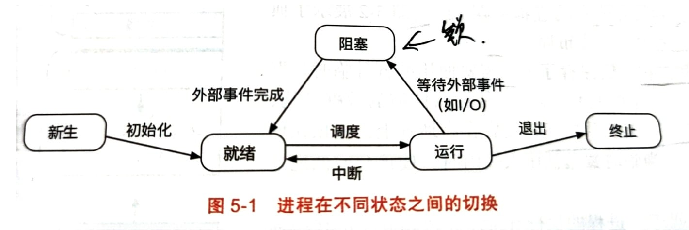
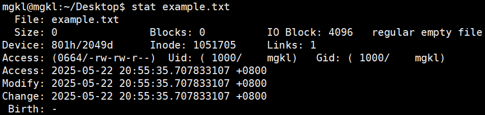
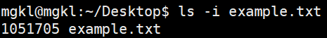
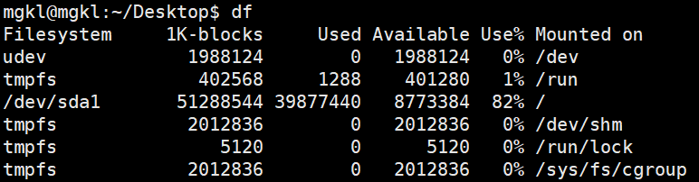
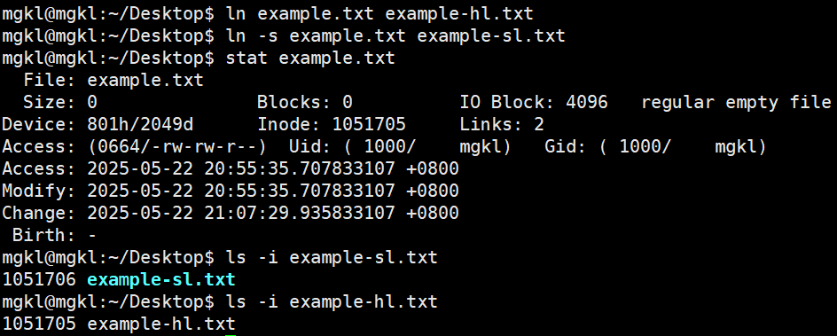

# 操作系统基础

## 计算机系统基础

[原文链接](https://www.csview.cn/os/summary.html)

### 操作系统的概念

操作系统是管理计算机硬件和软件资源、给应用程序和用户提供底层抽象的系统软件，负责协调、控制和管理计算机硬件设备、系统资源和应用程序的执行。

**硬件管理**

**文件管理**

**进程管理**

**内存管理**

**系统安全和保护**

**用户接口**

**系统服务和应用程序支持**

### 冯·诺依曼结构

冯·诺依曼结构是一种存储式计算机结构，其特点在于将计算机程序和数据都存储在相同的存储器中，并通过中央处理器进行处理和执行。

- 存储器（Memory）：负责存储计算机程序和数据；

- 中央处理器（CPU）：负责执行存储器中的程序指令；

    - 算术逻辑单元（ALU）：负责执行算术和逻辑运算；

    - 控制单元（CU）：负责从存储区获取指令、解析指令并控制计算机系统各个组件按照指令进行操作。

- 输入设备（Input）：用于将外部数据输入到计算机系统；

- 输出设备（Output）：用于将计算机系统的处理结果输出到外部设备；

- 总线

    - 数据总线：负责在各个部件之间传输数据；

    - 地址总线：负责传输数据所对应的存储器地址；

    - 通信总线：负责传输控制信号，协调和同步各个组件的工作。

### 外中断和异常

外部中断和异常都是计算机系统用于处理非正常或特殊情况的机制。

- 外部中断：由计算机系统外部事件触发，当外部中断发生时，说明某个外部设备需要处理器的注意，如设备需要传输数据或发生错误等；

- 异常：计算机系统内部事件触发，通常与正在执行的程序或指令有关，目的是通知处理器某个指令无法正常执行，需要采取特殊处理。

### CPU 地址翻译

CPU 地址翻译是将虚拟地址转化为物理地址的过程。

地址翻译的目的是实现虚拟内存，从而每个进程都有一致的、连续的地址空间，从而简化编程和内存管理。

**虚拟地址与物理内存的映射方式**

- 分页

    分页系统将虚拟内存和物理内存分化成固定大小的（页）并实现虚拟页与物理页之间的映射（页表）；

    **虚拟地址组成**
    
    - 虚拟页号（Virtual Page Number，VPN）：用于标识虚拟内存中的页；

    - 页内偏移（Offset）：用于标识地址位于页内的位置。

    **地址翻译**
    
    1. 提取虚拟地址中的 VPN；
    
    2. 根据页表将 VPN 转换为物理页框号（Physical Frame Number， PFN）；
    
    3. 将 PFN 与 Offset 组成物理地址。

    **多级页表**

    在处理大地址空间时，单级页表的体积可能非常庞大且浪费内存资源。

    多级页表能够有效减少页表的体积，但虚拟地址被分为多个部分，每个部分用于在不同级别的页表中查找，且最后一级页表包含实际的 PFN。

    **页表缓存 TLB**
    
    在多级页表中，地址的翻译可能需要多次访问内存，从而产生性能开销。
    现代处理器使用 TLB（Translation Lookaside Buffer）的硬件缓存来记录最近访问的 VPN 与 PFN 的映射关系。
    
    在 CPU 进行地址翻译时，先查询 TLB 缓存，如果能够找相关映射，则不再访问页表（TLB 命中）；否则，CPU 使用页表进行地址翻译找到映射后，会将该映射缓存到 TLB 中（TLB 未命中）。

    - 关联性

        - 全关联：任何虚拟地址可以放在 TLB 的任何位置；

        - 组关联：TLB 被分为多个组，每个组均可容纳一定数量虚拟内存，虚拟地址根据特定特略被映射到某个组中；

        - 直接映射：每个虚拟地址固定映射到一个位置。

    - 替换策略

      - 最近最少使用（LRU）

      - 随机替换（Random）

- 分段

### TLB

### 指令周期与类型

- 指令周期

    - 取指：从存储器中获取指令；

    - 解码：将指令转换为控制信号和操作数；

    - 执行：根据指令类型，执行相应操作；

    - 访问：如果指令涉及内存操作（加载、存储），则访问内存；

    - 写回：将执行结果写回寄存器。

- 指令类型

    - 算术指令

    - 逻辑指令

    - 移位指令

    - 控制流指令：用于改变程序执行流程，如跳转、分支或函数调用等；

    - 数据传输指令：负责寄存器、内存和 I/O 设备之间的数据传输。

    - 特殊指令

### 局部性原理（引用局部性）

局部性原理描述了程序在一段时间内，对内存地址的访问倾向于集中在某个较小的地址范围内（空间局部性？）。

- 时间局部性：在一段时间内，一个内存地址被多次访问（如循环体）；

- 空间局部性：如对数组的访问。

- 应用

    基于局部性原理对数据和指令进行预取策略。

    - 高速缓存：当 CPU 访问内存时，Cache 根据局部性原理提前加载附近的数据和指令，从而避免对较慢贮存的访问。

    - TLB 

    - 磁盘调度

### 用户态与内核态

用户态和内核态时操作系统为了保护系统资源和实现权限控制而设计的两种不同的 CPU 运行级别，用户态时程序运行时的正常状态，而内核态是系统在执行内核代码或响应系统调用时的特权状态。

**区别**

- 权限：内核态具有执行所有指令和访问所有内存空间的权限，而用户态不能访问内核地址或执行特权指令；

- 代码：内核态主要执行操作系统的内核代码，如中断处理程序、设备驱动、文件系统等，而用户态主要执行应用程序的代码；

- 资源访问：内核态可以直接受保护的系统资源，如硬件设备、中断、内核数据结构等，而用户态不可以。

**切换场景**

- 系统调用：当用户程序通过系统调用请求操作系统提供服务时，系统会触发特殊中断，将 CPU 从用户态切换到内核态，在内核态下，操作系统执行相应的服务例程，完成请求后，再通过中断返回指令将 CPU切换回用户态；

- 异常：在程序执行过程中出现错误或异常情况（如算术异常、缺页等）；

- 外部中断：由外部设备产生的中断信号。

**切换过程**

1. 保存处理器状态和错误信息至寄存器，如异常触发的指令地址、PC（程序计数器）、异常原因以及栈指针 SP；

2. 从用户态切换到内核态，CPU 获取异常向量表，根据异常原来调用相应的异常处理函数；

3. 异常处理完毕后，恢复存储的应用现场，如 PC 与 SP 指针等，从内核态切换到用户态，。

### CPU 缓存

**缓存替换策略**

- 随机替换：随机替换

- 最近最少使用（LRU）：替换缓存中最久未使用的数据或指令；

- 最不经常使用（LFU）：替换缓存中使用频次最低的数据或指令；

- 先进先出（FIFO）

**缓存分级**

- L1 级缓存

    - L1 数据缓存

    - L1 指令缓存

- L2 级缓存：在 L1 缓存未命中时提供更大的数据和指令缓存空间；

- L3 级缓存：由所有核心共享，用于在不同核心之间共享数据；

**缓存一致性**

缓存一致性用于确保各个核心之间的数据一致性。

- 写操作一致性

    - 确保某个核心对某个内存地址的写操作能够被其他核心看到；
    
    - 确保多个核心对同一地址的写操作有明确的顺序。
  
- 事务性：对内存的写操作要么完全执行，要么完全不执行。

**MESI 协议**

- **M**odified（修改）：缓存行中的数据已修改，与内存中的数据不一致；

- **E**xclusive（独占）：缓存行中的数据与内存中的数据一致，且该数据仅存储在当前缓存中；

- **S**hared（共享）：缓存行中的数据与内存中的数据一致，也可能存在于其他处理器核心的缓存中；

- **I**nvalid（无效）：缓存行中的数据无效（其他核心修改了数据或者处理器失去了对该数据的独占权）。

当一个处理器核心需要执行读/写操作时，它会向其他处理器核心发送请求，并根据其他核心的缓存状态来更新自己的缓存行。

### 伪共享问题

伪共享指的是多个处理器核心频繁访问位于同一个缓存行内的不同数据，此时处理器核心访问的数据实际上并未共享，但因为处于相同的缓存行内，因为缓存一致性协议的存在而被误认为是共享的，从而导致不必要的缓存同步操作。

比如CPU 1 和 CPU 2 分别读取位于同一缓存行内的变量 A 和变量 B：

1. CPU 1 先读取变量 A，此时缓存行由 CPU 1 独占；

2. CPU 2 去读取变量 B，此时缓存行由 CPU 1 和 CPU 2 共享；

3. CPU 1 修改变量 A，它会通知 CPU 2 该条缓存失效；

4. CPU 2 修改变量 B，它会先把缓存行写回内存，再取出 Cache 再写入 B。

**解决方案**

- 数据对齐与填充

- 优化数据布局

- 降低共享数据的使用

- 使用无锁数据结构

## 并发

## 内存管理

### 换页抖动

操作系统频繁发生缺页中断并进行换页操作，从而导致系统性能下降。

**原因**
    
- 过高的内存需求：进程所需内存空间超过可用物理空间，操作系统需要频繁的再物理内存和磁盘之间交换内存页面；

- 不恰当的内存分配：操作系统不合理的资源分配；

- 不合理的页面置换算法

**解决方法**

- 资源控制：限制进程对内存的使用量；

- 内存管理优化：采用合理的内存管理技术和页面置换算法；

- 内存扩展

### 进程内存分布

- 代码区：存放进程的可执行代码；

- 数据区：存储全局变量和静态变量，由程序在加载时分配；
    
    - 已初始化数据区：存储已初始化的全局变量和静态变量；
    
    - 未初始化数据区（BSS，Block Started by Symbol）：存储未初始化的全局变量和静态变量；

- 堆区：存储动态分配的内存，堆内存可以在进程运行的过程中动态变化；

- 栈区：存储函数调用过程中的局部变量、函数参数和返回地址等信息；

- 内核空间：存储内核代码和数据。

**堆对象 Vs. 栈对象**

- 内存管理效率：栈上内存在程序编译时确定，而堆内存需要搜索可用空间；

- 缓存局部性：栈上的内存分类是连续的且与程序的执行顺序相关，而堆上分配的内存可能在物理地址上不连续，从而导致缓存命中率低；

**栈上内存分配的好处**

- 减少内存碎片化：内存分配连续；

- 释放对象：对象在离开作用域时自动释放！


### malloc 实现

- 初始化内存池：在 malloc 首次调用时，初始化内存池。

- 寻找合适内存块：在 freeList 列表中查找可满足需求的内存块；找不到，则向系统申请新的内存块；

- 分割内存块：如果查找到的内存对象大于请求对象，malloc 可能会将该内存对象分为两部分，一部分用作返回，另一部分则保留在 freeList 中

- 更新数据结构：将查找到的内存对象从 freeList 移除并更新相应数据结构；

- 返回内存块地址

### mmap 实现

mmap 用于将文件或其他对象映射到进程的虚拟地址空间。

- 参数检查：检查参数的合法性，如文件描述符、映射长度、访问权限、文件偏移等;

- 创建虚拟内存区域（Virtual Memory Region, VMR）：操作系统请求创建指定长度的虚拟内存区域，该长度由映射长度决定；

- 建立文件与虚拟内存区域的关联：

    - 私有关联：对映射区域的修改不影响原始文件；

    - 共享关联：对映射区域的修改会同步到原始文件。

- 延迟加载：mmap 采用延迟加载的策略加载映射文件的内容到内存中，即仅当应用程序实际访问映射区域时才加载所需的文件内容；

- 缺页处理

- 内存写回（共享映射）：采用写回（write-back）策略，即在一段事件后或者内存压力增大时将修改后的内容写回到文件；

- 释放内存映射：使用 munmap 释放映射区域;

    - 内存写回（如果仍有未写回的）；

    - 释放与映射区域相关的物理内存页；

    - 从进程的虚拟内存地址空间中删除映射区域，并完成清理工作。

### 共享内存实现

共享内存是一种进程间的通信机制（IPC），允许多个进程访问同一块内存区域。

- 创建共享内存区域：使用 shmget 系统条用创建共享内存标识符；

- 将共享内存区域映射到进程地址空间：每个需要访问共享内存区域的进程使用 shmat 将其映射到自己的虚拟地址空间；

- 读写共享内存：需要通过同步原语来避免数据竞争和不一致性；

- 取消映射共享内存区域：进程可以使用 shmdt 取消共享内存区域在其虚拟地址空间的映射；

- 删除共享区域：当所有进程都不再需要共享内存区域时，可以使用 shmctl 的 IPC_RMID 命令来删除共享内存区域。

## 进程与线程管理

### 进程、线程、协程

### 进程调度算法

- 时间片轮转（RR）：将 CPU 划分为一个个时间片，每个任务独占 CPU 的一个时间片；

- 优先级调度：在 RR 的基础上，识别不同的任务类型，然后设置相应的优先级，即有明确截止时间的任务 > 交互式任务 > I/O 密集型任务 > 批处理任务；

- 先来先服务（FCFS）：最先到达的任务具有最高调度优先级，但对短任务不友好；

- 最短任务优先 (SJF)：按照执行时间确定任务的优先级，执行时间越短优先级越高，但需要预知任务的运行时间（非抢占）；

- 最短完成时间优先（STCF）：按照任务剩余时间来确定任务的优先级，剩余时间越短优先级越高（抢占式），但容易造成长任务饥饿问题；

- 多级队列（MLQ）

    - 明确指定任务的优先级（静态设置）；

    - 为不同优先级设置一个队列，优先处理具有高优先级队列中的任务；

    - 不能解决低优先级任务的饥饿问题。

- 多级反馈队列（MLFQ）

    - 动态设置任务的优先级；

    - 短任务具有更高的优先级；

### 进程间通信（IPC）

- 管道

    

    管道（Pipe）是一种单向的 IPC 方式，系统会分别用两个文件描述符来代表管道的两端，其中 pipe[1] 指向写端，而 pipe[0] 指向读端。

    - 匿名管道：通过 `pipe()` 系统调用创建的两个文件描述符，由于匿名管道没有名字，所以匿名管道一般用于两个关系比较近的进程，如使用 `fork()` 系统调用创建的父子进程； 

    - 命名管道：通过 `mkfifo()` 系统调用创建，需要指定权威那句的文件名称与权限；

- 消息队列

    - 消息队列以消息作为数据抽象，消息队列在内核中的数据结构为由单链表构成的队列，每个消息都会有指向下一个消息的指针以及消息的本身的内容。

    - 使用消息队列进行消息传输时，需要先将数据复制到内核，然后再从内核复制到接收端进程。

- 信号量

    - 信号量用于在多个线程之间同步有限数量资源的使用情况；
  
    - 信号量涉及两个原语
      
        - P 操作：将信号量减 1，如果失败则进入阻塞状态；

        - V 操作：将信号量加 1，并可以唤醒一个因为 P 操作阻塞的进程。

- 共享内存

- 信号

    信号用于进行单项事件通知，一个进程会为某些特定的信号注册回调函数，当进程收到相应信号后，内核会自动调用该信号的回调函数。

### 进程虚拟化

进程虚拟化允许在同一各计算机上运行多个进程，且为每个进程提供独立的虚拟地址空间和资源。

进程虚拟化的目的是提高资源利用率、隔离进程以保证系统安全和稳定性以及简化进程管理和调度。

- 虚拟地址空间：每个进程都有自己的虚拟地址空间，虚拟地址通过内存管理单元（MMU）转换为物理地址；

- 上下文切换：保存当前进程的状态（寄存器、程序计数器、内存映射等），然后恢复另外一个进程的状态，从而实现进程切换；

- 进程隔离：确保单个进程的错误或恶意行为不会影响其他的进程和系统，进程隔离通过虚拟地址空间、内存保护和权限控制等机制实现，如一个进程无法直接访问另外一个进程的内存（IPC 和内存共享除外）；

- 进程调度


### 进程状态



- 新建：进程处于新建状态，操作系统为进程分配必要的资源（内存、文件描述符等）并初始化进程控制块（PCB）等数据结构；

- 就绪：进程已经准备运行，等待操作系统调度器分配 CPU 时间片，即操作系统为进程分配了除 CPU 时间片外的所有必要资源；

- 运行：每个 CPU 或核心上最多有一个进程处于运行状态；

- 阻塞：进程因为等待某个事件（如 I/O 操作、信号或锁释放等）而暂停执行，在阻塞状态下，进程无法继续执行，直至等待事件的发生；

- 终止：进程已经完成或因为某种原因被终止，在终止状态下，进程资源被回收。

### 进程创建

- 父进程使用 fork() 系统调用创建子进程

    fork() 系统调用会复制父进程的控制块、虚拟内存、文件描述等数据结构，从而创建一个与父进程相似的子进程；

- 子进程修改内存映射

    写时复制（Copy-On-Write）允许子进程在创建时共享父进程的内存页面，直到需要修改页面内容时才复制页面，从而避免不必要的内存复制；

- 子进程使用 exec() 系统调用（可选）

    如果子进程需要与父进程执行不同的程序，exec() 系统调用会将新程序的代码数据到内存，然后将程序计数器指向新程序的入口点（不影响进程控制块、文件描述符等数据结构）；

- 子进程开始执行

- 父进程等待子进程（可选）

    父进程可以选择等待子进程的完成，以获取子进程的退出状态和回收资源。

### 守护进程、僵尸进程、孤儿进程

- 守护进程

    守护进程是一种运行在后台的特殊进程，通常用于提供某种服务或执行定期任务。
  
- 僵尸进程

    僵尸进程是一种已经终止但仍占用进程表（Process Table）空间的进程。

    当一个进程终止时，其子进程的状态会变为僵尸进程，直到父进程通过 wait() 或 waitpid() 系统调用回收其资源，僵尸进程不占用 CPU 或内存资源，但会占用进程空间表！

- 孤儿进程

    孤儿进程是指父进程在子进程之前终止，导致子进程失去父进程的情况，孤儿进程会被 init 进程收养，init 进程会定期调用 wait() 或 waitpid() 系统调用以回收孤儿进程的资源。

## 文件系统

文件是操作系统进行存储时使用最多的抽象之一，每个文件实际上是一个有名字的字符序列，该字符序列的内容为文件数据，而用于描述该文件属性特征的信息为文件元数据。

文件系统用于管理文件数据和文件元数据，其提供文件抽象并实现文件访问所需的接口。

### Inode 文件系统结构

Inode 是 UNIX 和类 UNIX 文件系统中用于存储文件或目录的元数据（如文件大小、时间戳、权限、所有者等）及指向实际文件数据块的指针。

每个文件/目录对象都有唯一的 Inode 号标识。

**Inode 文件系统结构组成**

- Inode 表：用于存储 Inode 的数据结构，Inode 表的大小决定了文件系统能够容纳的最大文件或目录数量；

- 数据块：用于存储文件内容的基本单位，Inode 中的数据块指针可以直接指向数据块，也可以指向索引数据块（间接数据块）；

- 目录项：用于表示文件系统中目录结构的数据结构，目录项存储于目录文件的数据块中；

- 超级块：用于存储文件系统的元数据，如文件系统类型、大小、块大小以及 Inode 数量等。

### 硬链接Vs. 符号链接

链接用于创建文件或目录的引用，硬链接和软连接是两种不同的文件连接类型。

- 硬链接
  
    每个文件都有一个或多个文件名（硬连接），它们指向相同的 Inode。
    
    - 硬链接不能跨系统（硬链接直接与文件的 Inode 关联）；
    
    - 硬链接不能引用目录（避免循环引用问题）；
    
    - 删除文件的硬连接不会导致文件被删除（文件占用的内存空间会在最后一个硬链接被删除后释放）；
    
    - 硬链接在实际上是访问原始文件。

- 符号链接

    符号链接是一种特殊的文件（所以它有自己的 Inode），它包含指向另外一个文件或目录的路径。

    当用户访问符号链接时，文件系统会自动将其重定位到目标路径。

    - 符号链接允许跨系统；
  
    - 符号链接可以引用目录；
    
    - 删除符号链接并不影响目标文件，即删除符号链接时，仅链接本身被删除；
    
    - 如果目标文件被删除，符号链接将成为死链接，即符号链接不再指向有效的目标文件。

**基本使用**

[原文地址](https://ruanyifeng.com/blog/2011/12/inode.html)

```shell
# 查看 example.txt 文件的 inode 信息
stat example.txt
```



```shell
# 查看 example.txt 文件的 inode 号
ls -i example.txt
```



```shell
# 查看文件系统硬盘空间使用
df
```



```shell
# 使用 ln 创建硬链接
ln example.txt example-hl.txt

# 使用 ln -s 创建硬链接
ln -s example.txt example-sl.txt

# 查看软/硬链接的 inode 号
ls -i example-sl.txt

ls -i example-hl.txt
```

