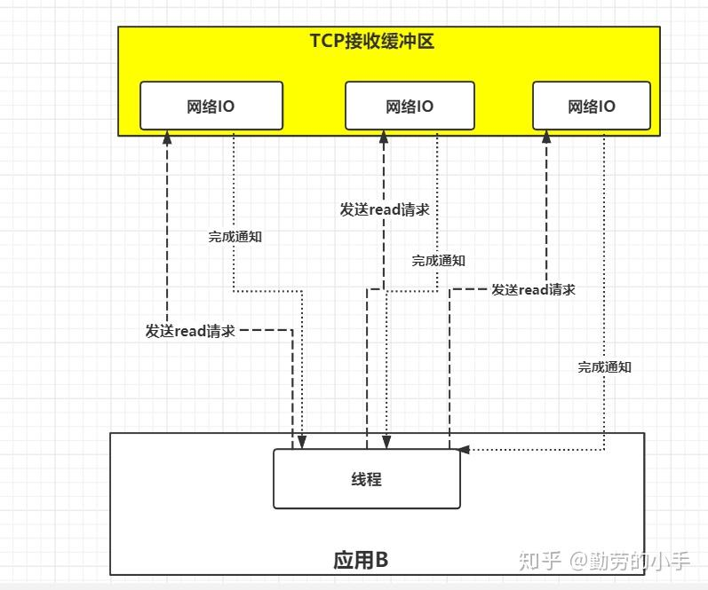
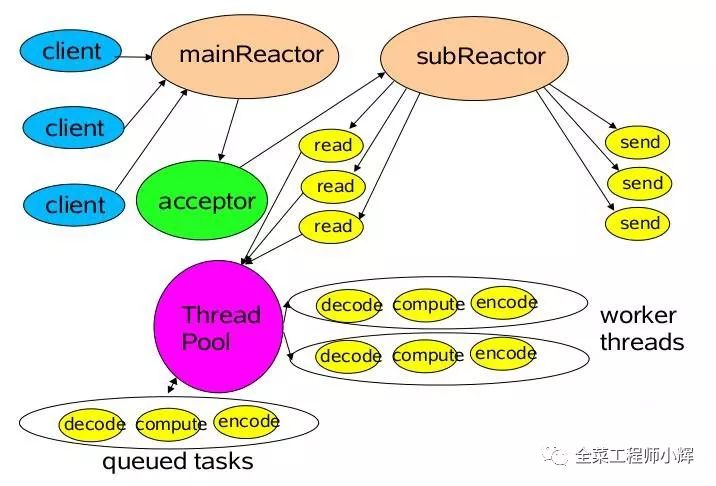

# I/O 模型

## 1. 同步阻塞 I/O


由用户进程（或线程）主动发起 I/O 请求，需要等待内核 I/O 操作完成后才能返回用户空间，在内核 I/O 操作执行过程中，用户进程（或线程）处于阻塞状态。

## 2. 同步非阻塞 I/O


由用户进程（或线程）主动发起 I/O 请求，不需要等待内核 I/O 操作完成就能立即返回用户空间，在内核 I/O 操作执行过程中，用户进程（或线程）处于非阻塞状态，但需要用户进程（或线程）不断地轮询 I/O 数据的可用状态，会占用 CPU 资源，效率较低。

## 3. I/O 多路复用


在并发环境下，对于 N 个 I/O 请求，服务器端的应用需要创建 N 个线程去处理 I/O 操作，这种处理方式将消耗大量的系统资源，使得服务器的性能严重受限。


I/O 多路复用使用单个线程来监控多个网络 I/O 请求。I/O 多路复用通过是同系统提供的 select、poll 或 epoll 系统调用来监控多个 fd，当有 fd 就绪时，内核将所有 fd 的就绪状态返回给用户进程（或线程），用户空间则可以根据 fd 的就绪状态来进行相应的 I/O 系统调用。

## 4. 异步 I/O




由用户进程（或线程）发起 I/O 请求，当内核收到请求后，建立一个相应的信号联系，在数据准备就绪时，内核会主动将数据复制到用户空间，等所有 I/O 操作完成时，内核将发起一个通知告诉相关应用。

异步 I/O 与同步 I/O 之间最大的区别在于：异步 I/O 只需要用户进程（或线程）发送一次 I/O 请求，而同步 I/O 需要在发布请求 I/O 且等待内核完成数据的准备工作后，再进行数据从内核到用户空间的复制工作。

## 5. 信号驱动 I/O 模型


信和驱动 I/O 模型是一种同步 I/O 模型，与异步 I/O 过程相似，但内核并不会主动将数据复制到用户空间，因此需要额外的系统调用。

# Reactor 模型

## 三种角色

- Reactor：负责监听和分配事件（建立就绪、读就绪、写就绪等），将 I/O 事件分配给对应的 Handler。
  
- Acceptor：负责处理与客户端之间的新连接。

- Handler：将自身与事件绑定，非阻塞的执行读/写任务。

## Reactor 请求处理流程

1. 应用程序注册就绪事件及其事件处理器；

2. dispatch 等待事件的发生；

3. 当就绪事件发生时，dispatch 调用 1. 中注册的事件处理器。

## 单线程、单 Reactor


单线程单 Reactor 模型仅是在代码进行了组件上的区分，单整体操作还是单线程，不能充分利用系统的硬件资源。

**消息处理流程**

1. Reactor 对象通过 select/poll/epoll 进行事件监听，由 dispatch 进行事件的转发；

2. 如果 1. 中事件为连接建立事件，则由 acceptor 进行接受连接并创建 handler 以处理后续事件；

3. 如果 1. 中事件为非连接建立事件，则由 handler 进行事件处理；

4. handler 需要完成请求读取、业务处理以及数据发送的完整流程。

## 多线程、单 Reactor

在 handler 部分采用线程池来处理业务逻辑。


**消息处理流程**

1. - 3. 同单线程单 Reactor 模型
   
4. handler 只负责读取和数据发送部分；
   
5. 业务部分由线程池中的 worker 线程进行处理。

## 多线程、主从 Reactor

在多线程单 Reactor 模型的基础上进一步剥离 Reactor 的功能划分。



1. 主 Reactor 负责监听网络 I/O 的连接建立操作并将建立的 socket channel 注册到从 Reactor；

2. 从 Reactor 负责监听与 I/O 的读写操作。

# Proactor 模型


Proactor 使用异步 I/O 操作，是一种异步网络模型。

**基本工作流程**

- Proactor Initiator 负责创建 Proactor 和 Handler 对象（1.1以及 1.2）并通过 Asynchronous Operation Processor 将 Proactor 和 Handler 对象注册到内核（1.3）；

- Asynchronous Operation Processor 处理注册请求以及 I/O 操作（2）；

- Asynchronous Operation Processor 完成 I/O 操作后通知 Proactor(3);

- Proactor 根据不同的事件类型回调不同的 Handler 进行业务处理（4）。

# I/O 多路复用之 select、poll 和 epoll

## select 

```cpp
int select (int nfds, fd_set *readfds, fd_set *writefds, fd_set * exceptfds, struct timeval *timeout);
```

- `readfds`, `writefds` 和 `exceptfds` 分别用于检测 I/O 是否读就绪、写就绪以及异常发生;

- `nfds` 用于记录上述三个文件描述符数值 + 1;

- 返回值

  - \> 0：集合中已就绪 I/O 总个数
  - = 0：没有就绪 I/O
  - = -1：调用失败
  
`fd_set` 在本质上是一个数组。

```cpp
// 将 fd 从 set 集合中删除
void FD_CLR(int fd, fd_set *set);

// 检查 fd 是否存在于 set 集合中
int FD_ISSET(int fd, fd_set *set);

// 将 fd 添加到 set 集合中
void FD_SET(int fd, fd_set *set);

// 将 set 中所有 fd 的标志位设置为 0
void FD_ZERO(fd_set *set);
```

**存在问题**

- 每次使用系统调用 select，都需要将被监控的 fds 集合从用户态的空间拷贝到内核态空间，不适用于高并发场景；
  
- 监听端口数量有限，单个进程所能打开的最大连接数由 FD_SETSIZE 定义；

- 在被监控的 fds 中，即使仅有一个数据可读，整个 socket 集合也会被遍历一次调用 poll 收集可读事件。

## poll

poll 在实现上与 select 类似，只是对 fd 集合的表示方式不同，解决了 select 只能监听由有限数量的端口问题。

```cpp
struct pollfd {
    // 文件描述符
    int fd;

    // 监听事件
    short events;

    // 监听事件中满足条件返回的事件
    short revents;
};

int poll(struct pollfd *fds, unsigned long nfds, int timeout);
```

- `events` 委托内核检测的 fd 事件;

- `revents` 存储检测之后的结果;

- `timeout`

    - -1：一直阻塞，直到检测到集合中有就绪的 I/O 事件；
    - 0：不阻塞，不管检测集合中有无已就绪的 I/O 事件，函数都将返回；
    - \> 0: 以毫秒为单位的超时时间，函数在超时后返回。

- 返回值

    - 1： 调用失败
    - \> 0: 表示检测集合中已就绪的文件描述符的个数

## epoll

**epoll_create**

```cpp
int epoll_create(int size);
```

返回创建一个 epoll 句柄，该句柄由 epoll 专用文件描述 epollfd 来表示。

- `size` 用于告知内核监听 fd 的数目

**epoll_ctl**

```cpp
int epoll_ctl(int epfd, int op, int fd, struct epoll_event *event);
```

- `op` 对 epfd 执行的动作
  - `EPOLL_CTL_ADD`：注册 fd 到 epfd 中；
  - `EPOLL_CTL_MOD`：修改已经注册的 fd 的监听事件；
  - `EPOLL_CTL_DEL`：从 epfd 中删除一个 fd。

- `epoll_event`
  - `EPOLLIN`：可读事件；
  - `EPOLLOUT`：可写事件；
  - `EPOLLPRI`：紧急数据可读；
  - `EPOLLERR`：错误事件；
  - `EPOLLHUP`：fd 被怪奇；
  - `EPOLLET`：将 epfd 设置为边缘触发模式（默认为水平触发 LT）；
  - `EPOLLONESHOT` 只对 fd 进行一次事件监听（如果需要继续监听，则需要将该 fd 再次加入 EPOLL 队列）。

**epoll_wait**

```cpp
int epoll_wait(int epfd, struct epoll_event *events, int maxevents, int timeout);
```

- `events`：分配好的 epoll_event 结构体数组，epoll 会把发生的事件赋值到 events 数组中。

- `maxevents`：maxevents 用于告诉内核有多少个 events

- 返回值
  - \> 0：返回需要处理的事件数目；
  -  = 0：时间超时；
  -  -1：失败调用。

**水平触发（Level Trigger）**

在水平触发中，关注点为缓冲区中数据是否有无。因此，只要读缓冲区不为空，写缓冲区不满；那么 epoll_wait 就一直返回就绪状态。

水平触发是 epoll 的默认工作方式。

**边缘触发（Edge Trigger）**

在边缘触发中，关注点为缓冲区数据是否发生变化。因此，epoll_wait 仅在数据发生变化时返回就绪状态（有 -> 无， 无 -> 有，多 -> 少， 少 -> 多）；那么，这就意味着，如果我们使用边缘触发模式就需要保证一次性将所有数据读取/写入。

## epoll 相比 select、poll 更高效

- epoll 采用红黑树对文件描述符 fd 进行管理，红黑树是一种自平衡的二叉树，其树节点的插入和删除的平均复杂度均为 `O(logn)`。select 和 poll 方式的事件复杂度与文件描述符的数量呈线性关系，即 `O(n)`。

- epoll 将文件描述符的添加和检测分离，从而减少了文件描述符拷贝的性能开销。
