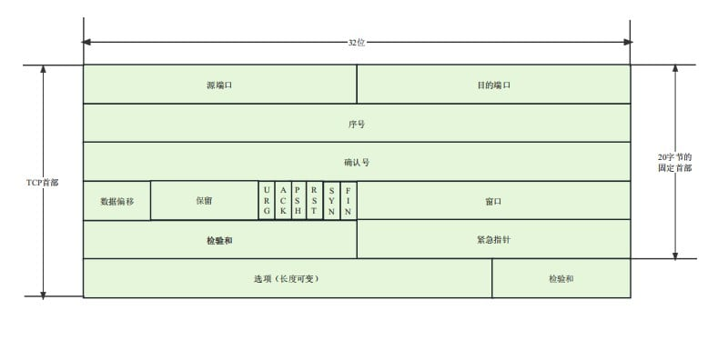
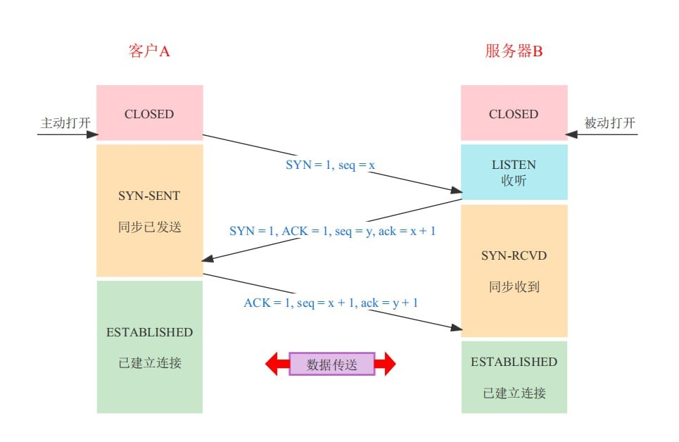
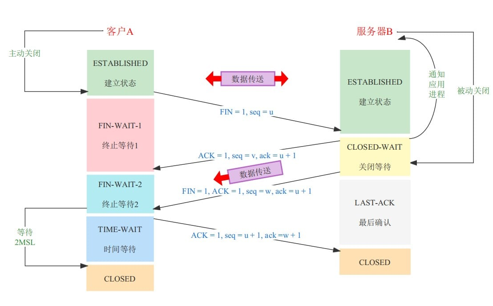
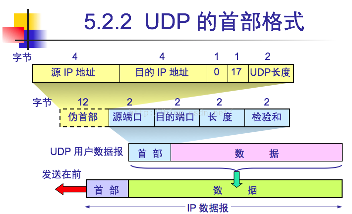
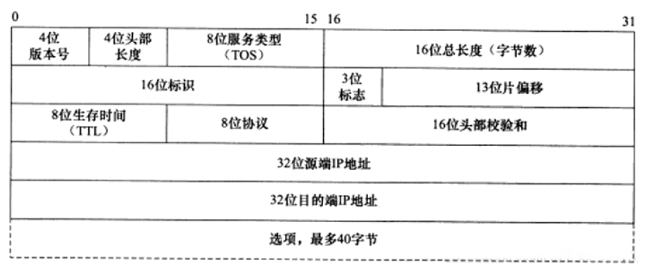
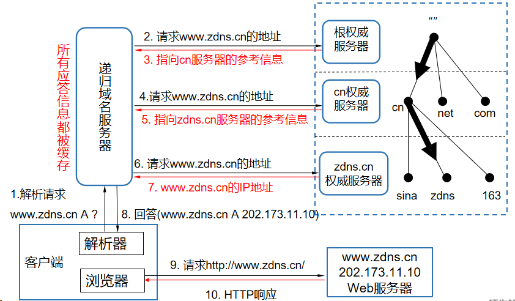
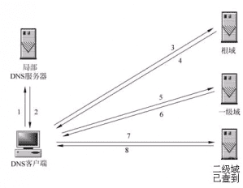

# TCP/UDP 基本知识

[原文链接](https://www.csview.cn/network/tcp.html)

## TCP 

## TCP 头部

- **数据偏移（首部长度）**：4 位，TCP 首部可能包含可选内容，故 TCP 头部长度是可变的，但 TCP 允许的最长头部长度为 60 字节，其中固定部分占 20 字节。

- **窗口**：16 位，TCP 流量控制的方式，用于告知 TCP 的发送方接收缓冲区还能容纳多少字节的数据。

- **校验和**：16 位，用于在接收端执行 CRC 算法检验 TCP 报文的完整性，包括头部和数据部分。

- **控制位**：

  - **URG**：紧急指针标，该位设置时表示紧急指针有效；

  - **ACK**：确认号，用于告诉发送方所期待的下一个字节数据的序号；

  - **RST**

  - **SYN**：用于请求建立连接，该位设置时 TCP 报文称为同步报文；

  - **FIN**：用于释放连接，该位设置时 TCP 报文成为结束报文；

  - **PSH**：PUSH 标志，该位设置时表示该报文段应优先将该报文交给应用程序，而非在缓冲区排队。

### TCP 可靠传输保证机制

- 校验和

- 连接管理

- 流量控制

- 拥塞控制

    - 慢启动（并不慢，只是起点低！）
    
        - 拥塞窗口（cwnd）初始化大小为 1;

        - 每一个未发生重传的 RTT 后，cwnd = cwnd * 2（每个 ACK 都会将 cwnd + 1 的结果）；
      
        - 当发生 cwnd >= ssthresh，进入拥塞避免状态！

    - 拥塞避免
        
        - 每一个未发生重传的 RTT 后，cwnd = cwnd + 1（此时 cwnd 线性增长！）；

        - 当发生数据包丢失时，进入拥塞处理状态！
    
    - 超时重传（拥塞处理）

        - ssthresh = cwnd / 2

        - cwnd = 1

    - 快重传（拥塞处理）

        - cwnd = cwnd / 2

        - ssthresh = cwnd

    - 快恢复
        
        - 接收到三个相同的 ACK 报文（即发送冗余 ACK）
        
        - cwnd = cwnd + 3

        - 进入拥塞避免状态 

### TCP 三次握手

**一般流程**：

- 客户端请求建立连接，将报文首部的 SYN 标识设置为 1，选择初始化序列号 seq 为 x，此时 客户端进入 SYN_SENT 状态；

- 服务器接收来自客户端的 SYN 报文后，将报文（新的报文）首部的 SYN 和 ACK 标识位均设置为 1，确认序列号 ack 设置为 x + 1, 选择自己的初始化序列号 seq = y, 此时，服务器端进入 SYN_RECV 状态；

- 客户端接收到来自己服务器端的 ACK 和 SYN 报文，向服务器发送确认报文，其中 seq 设置为 x + 1，ack 设置为 y + 1，客户端和服务器端进入 ESTABLISHED 状态。

三次握手保证了服务端和客户端均能正常的发送和接收数据：

- 第一次握手，服务器端能够确定自己的接收能力正常；

- 第二次握手，客户端能够确定自己的发送能力和接收能力正常；

- 第三次握手，服务器端能够确定自己的发送能力正常。

**TCP 握手报文丢失**

客户端重传 SYN 报文的两种情况：

- 第一次握手的 SYN 报文未抵达服务器端；

- 第二次握手的 SYN-ACK 报文未抵达客户端。

服务器端重传 SYN-ACK 报文的两种情况：

- 第二次握手的 SYN-ACK 报文未抵达客户端；

- 第三次握手的 ACK 报文未抵达服务器端。

总上，有 SYN-ACK 报文的丢失可能引发客户端和服务器端的超时重传，第一次握手和第三次握手的丢失仅影响客户端或服务器端的超时重传。

！在 TCP 通信连接的建立过程中，纯 ACK 报文发生丢失是不会重传的，也就是说，只有 SYN 同步报文和 SYN-ACK 报文可能存在重传情况。

**三次握手的必要性**

- 避免旧的重复连接初始化造成混乱；

    在上述 **TCP 握手报文丢失** 的分析中，我们仅考虑了报文丢失的情况；但实际上，超时重传也会因为报文的延迟抵达而产生，此时，若在 TCP 通信放双通过超时重传的报文建立连接并完成数据传输后，该报文抵达服务器端，两次握手机制使得客户端与服务器再次建立连接, 从而造成资源的浪费。

- 同步通信双方的序列号。

    TCP 的可靠传输需要通信双方之间各自维护一个序列号，两次握手仅能保证客户端的序列号被服务器端确认，而服务器端的序列号不能保证被客户端确认。

### TCP 四次挥手

**一般流程**

- **第一次挥手**

    客户端停止发送数据，发送释放报文，其首部 FIN 标识被设置为 1，seq 被设置为 u，此时客户端进入 FIN-WAIT-1状态（FIN 报文消耗序列号）；

- **第二次挥手**

    服务器向客户端发送 ACK 报文，其 ack 被设置为 u + 1，此时服务器进入 CLOSE_WAIT 状态（连接处于半关闭状态，客户端仍能接收来自服务器端的数据）；客户端在收到 ACK 报文后进入 FIN-WAIT-2 状态）；

- **第三次挥手**

    服务器数据处理完毕，发送释放报文，其首部 FIN 标识被设置为 1，此时服务器进入 LAST_ACK 状态；

- **第四次挥手**

    客户端收到服务器的释放报文后，发送 ACK 报文，其首部 ACK 标识被设置为 1，此时客户端进入 TIME-WAIT 状态；

    服务器端收到来自客户端的 ACK 报文后，进入 CLOSED 状态。

### TCP 的延迟应答和累计应答

- **延迟应答**：TCP 在接收到报文后并不立即发送 ACK 报文予以确认，而是等待一段时间，以便能够将 ACK 报文和数据报文合并（Linux 采用动态调节算法来确定等待时间，以避免超时重传的发生）。

- **累计应答**：TCP 不对每个数据包都发送 ACK 报文，数据包之间的顺序由序列号保证，我们可以仅某个之前的序列号来 ACK 所有已经有序到达的报文。

### 长连接、短连接

- 长连接：适用于操作的频繁的点对点之间的连接，而且连接数量不能太多（连接本身占用资源），使用长连接可以避免频繁的连接建立过程（三次挥手）。

- 长连接的维持会占用服务器资源，当面对高并发场景时，使用短连接可以快速释放资源。

### TCP 的半连接队列（SYN 队列）和全连接队列（ACCEPT 队列）

服务器收到客户端的 SYN 请求后，内核将该连接添加到半连接队列，并向客户端发送 SYN-ACK 报文；服务器端在收到第三次握手的报文，内核会将该连接从半连接队列移除，并将其添加到全连接队列。

### SYN 攻击？

利用合理的服务器请求来占用过多的服务资源，从而使得服务器无法响应。

如果每接收到一个 SYN 报文，客户端就为每个请求分配一个线程控制块 TCB，并返回一个 SYN-ACK 报文（可能面临 SYN-ACK 重传），过多的 SYN 报文将使得服务器系统资源被耗尽。

**避免方法**

基本方法：（1）延迟 PCB 的分配时机，（2）检查连接请求的合理性，（3）减少 SYN-ACK 的重传次数。

- Cache（1）：先缓存连接请求，等完成三次挥手后再分配 TCB；

- Cookie & 防火墙（2）

## TCP Vs. UDP

- 面向连接、可靠传输、点对点通讯、可变首部（20-60字节），流式传输

- 尽最大努力交付、支持一对一、一对多、多对一、多对多等多种通讯方式、固定首部（8字节）、数据报

*注：UDP 首部校验和的计算包括伪首部，但伪首部并不作为 UDP 报文的一部分，用于确保 UDP 数据报在传输过程中目标地址和端口的正确性与完整性（传输岑和网络层的一致性）。*

# IP 基本知识

[原文链接](https://www.cnblogs.com/caojun97/p/16684978.html)

- IP 首部：长度可变（20-60字节）；

- 总长度：允许最长 IP 数据报长度 65535 字节；

- 标识符：唯一的标识每个 IP 数据报；

- 3 位标志：第一位保留，第二位为 1 则表示禁止分片，第三位表示是否还有更多分片（即最后一个分片该位置 0）；

- 13 位片偏移：相对于原始 IP 数据包起始位置的偏移（以8字节位基本单位，所以可能存在填充数据！）；

- 生存时间（Time To Live, TTL）: IP 数据包到达目的地址之前允许经过的路由器跳数（每经过一个路由器该值 -1， 当 TTL 为 0 时， 则丢弃该数据报！）。

- 协议：用于区分上层协议，如 ICMP 为 1， TCP 为 6， UDP 为 17；

- 头部校验和：使用 CRC 算法检验 IP 数据包的首部是否被损坏。

## DNS

[原文链接](https://zhuanlan.zhihu.com/p/698510659)

    

### DNS 查询方式

- 递归查询

    

- 迭代查询

    

### DNS 中的 TCP 与 UDP

DNS 在进行区域传输的时候使用 TCP 协议，其他时候则使用 UDP 协议。

- 区域传输的数据量相比单次 DNS 查询的数据量要大；

- 区域传输对数据的可靠性和准确性比普通 DNS 插叙要求高（主要原因！）

### URL 解析过程

键盘输入 -> URL 解析 -> TCP 连接 -> HTTP -> 页面熏染

### Cookie Vs. Session

- Cookie 

    - 由服务器生成，存储于客户端的数据块，会在客户端向服务器端发送请求时携带。
    
    - *Cookie 使得基于无状态的 HTTP 协议能够记录稳定的状态信息成为可能！*

- Session

    - 存储于服务器端，代表服务器与客户端的一次会话过程（客户端关闭或 Session 超时会使得会话失效！）。
    
**区别**

- 作用范围：客户端 Vs. 服务器端

- 存取方式：ASCII Vs. 任意数据类型（Maybe）

- 有效期：> 

- 安全性：<

- 存储限制：Cookie 单个不能超 4K, Session 取决于服务器！

### 跨域请求

浏览器不能执行其他网站的脚本。如 a 页面想要获取 b 页面资源，如果 a, b 页面的协议、域名、子域名、端口不同，所有的访问行动都是跨域的。（浏览器的同源策略将限制跨域访问，即不允许跨域请求资源！）
    